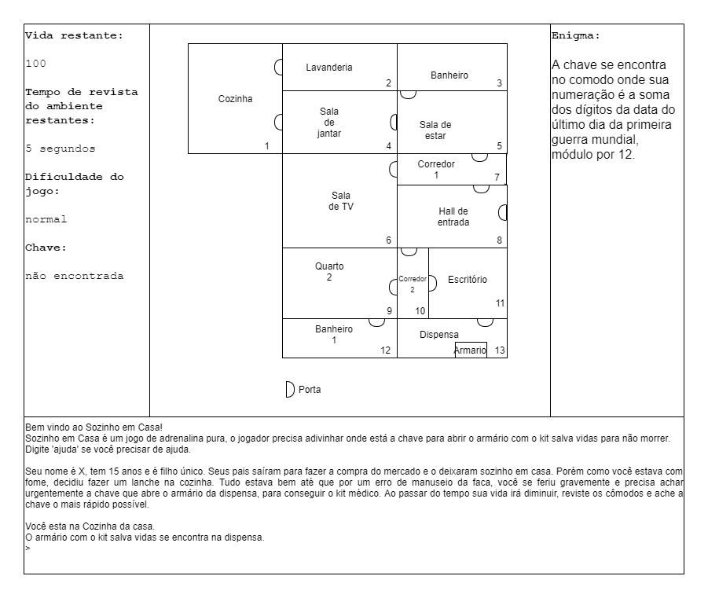

# home-alone

Nesse jogo, o jogador será um adolescente que se encontra em sua casa,
sem a presença de nenhum responsável e, por acidente, acabou se ferindo
gravemente e, por isso, precisa do kit de socorros que se encontra no armário na
despensa. Entretanto, para seu azar, o armário estava trancado e ele precisa
encontrar a chave, por outro lado, para sua sorte, há uma charada que pode te
ajudar debaixo do armário. Para encontrar a chave o X, nosso personagem, irá se
movimentar pelos cômodos da casa a procura da chave, porém, a medida que ele
anda seu sangue vai esguichando, cuidado, isso pode ocasionar morte. O jogador
vence o jogo somente se conseguir chegar ao kit de socorros.

O local em que a chave se encontra é definido aleatoriamente no início do
jogo. A velocidade em que perde vida, variando de 2 a 3, de acordo com a
dificuldade escolhida, além disso há também um tempo de procura de 5 segundos,
que é o tempo que X leva para revistar o cômodo a procura da chave, porém, X
pode, se quiser, apenas passar pelo quarto, sem perder tempo com a procura. Além
disso, o X sempre nascerá no cômodo “cozinha”, visto que será o local inicial onde
acabará se ferindo acidentalmente.
Exemplo de enigma: A soma dos dígitos da data do último dia da primeira
guerra mundial, módulo por 12.

Resposta: 10/11/1918: 1 + 0 + 1 + 1 + 1 + 9 +1 + 8 = 22
22 mod(12) = 10

